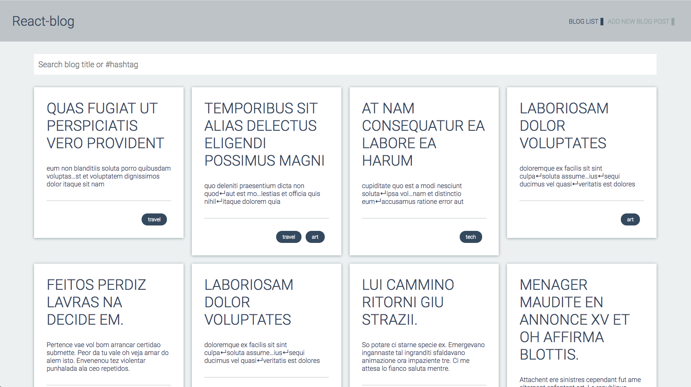

# React-blog

Making basic react-blog with React,Router and Redux. Here is [ the live demo](https://trungh13.github.io/integrify-assignment12-blog-react/) and the screenshot of application.

## Version
v0.2 Implementation with ReactJS, Router, Redux ([Source code in master-react-router-redux branch](https://github.com/trungh13/integrify-assignment4-webform/tree/master))

* Redo/re-structure the application with the Redux, React-redux.
* Implement search function by the Blog title or categories( with the # in front of)
* Deploy it to [gh-pages branch](https://github.com/trungh13/integrify-assignment12-blog-react/tree/master-react-router-redux) using [react-gh-pages](https://github.com/gitname/react-gh-pages)

v0.1 React,Router ([Source code in master-react-router branch](https://github.com/trungh13/integrify-assignment12-blog-react/tree/master-react-router))
  
  * Make simple blogs application with ReactJS, CSS Modules, Router.
  * In home page, there is Blog List views, and Add new Blog function
  * In Blog list, each Blogs have title, short description and categories in the Blog list views.
  * After clicking the Post, it goes to the Blog Post views which contain title, long content and categories with Delete, Edit button.

## Getting Started

These instructions will get you a copy of the project up and running on your local machine for development and testing purposes. See deployment for notes on how to deploy the project on a live system.

### Prerequisites

**You’ll need to have Node >= 6 on your local development machine** (but it’s not required on the server). You can use [nvm](https://github.com/creationix/nvm#installation) (macOS/Linux) or [nvm-windows](https://github.com/coreybutler/nvm-windows#node-version-manager-nvm-for-windows) to easily switch Node versions between different projects.

### Installing

A step by step series of examples that tell you how to get a development env running

```
git clone https://github.com/trungh13/integrify-assignment12-blog-react.git

cd integrify-assignment12-blog-react

npm install && npm start
```
---
©2018 Trung Hoang. Visit me on <a href="https://github.com/trungh13/">Github :octocat:</a> 